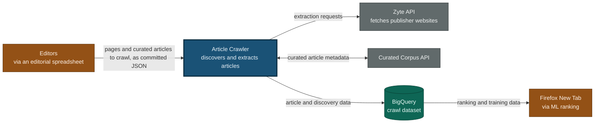
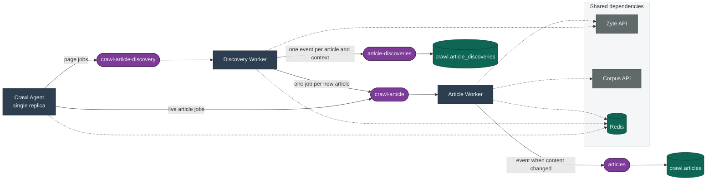
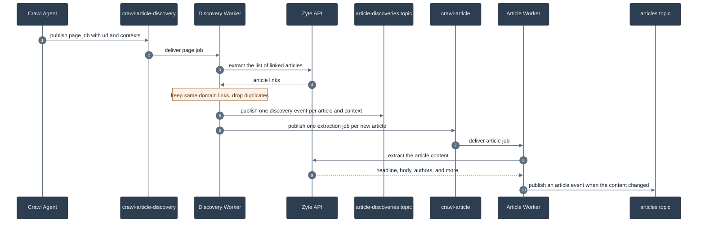
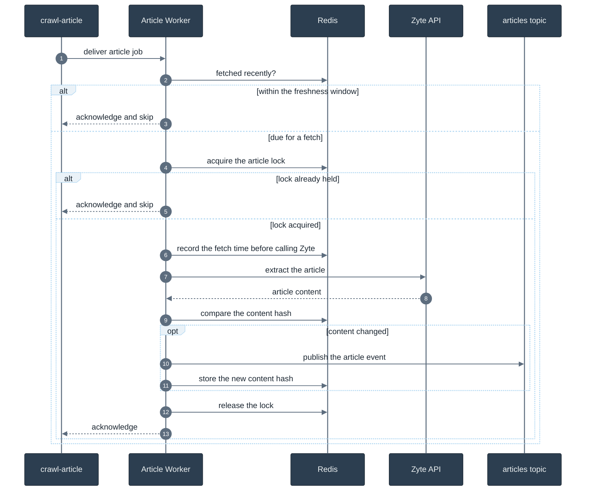

# Article Crawler Architecture

This document explains how the article crawler is put together and how content
flows through it. It stays at the level of components and data flow rather than
implementation detail. Read it to understand the main components and the path a
page takes from a publisher's website into BigQuery. For the full product
design, see the
[Article Crawler Technical Spec](https://mozilla-hub.atlassian.net/wiki/spaces/FPS/pages/1737064449).

## What the system does

The crawler keeps Firefox New Tab supplied with fresh article content. It visits
publisher pages, discovers the articles linked from them, extracts the text and
metadata of each article, and streams the results into BigQuery where machine
learning models rank them for readers. The design target is that a newly
published article reaches BigQuery within roughly 75 minutes, at a scale of
millions of articles per month.

The system is event driven. A small scheduler decides what to crawl, and a pool
of stateless workers does the crawling. The two sides never call each other
directly. They communicate through Pub/Sub. This lets the workers scale up and
down with demand and lets the system absorb bursts without losing work.

## System context

The crawler is a single system that sits between Mozilla's editorial curation
and the analytics that feed Firefox New Tab. This view shows who it talks to and
why. The next section opens the box.

Editors maintain the set of publisher pages and curated articles to crawl in an
editorial spreadsheet. That spreadsheet is exported to a JSON configuration that
is committed to this repository, and the crawl agent reads it on startup. The
crawler never fetches web pages itself. The Zyte API does the fetching and turns
raw HTML into structured article fields. Its relationship with the Curated
Corpus API runs both ways. Curated articles are the editorially approved items
that New Tab serves. When the crawler re-extracts one whose headline or excerpt
has changed, it writes the correction back to the Curated Corpus API so the copy
readers see stays accurate, and it can also read the current set of curated
articles from that API. Everything the crawler produces lands in the BigQuery
crawl dataset, where the machine learning pipeline reads it to rank content for
Firefox New Tab.

## Components

Everything is one TypeScript monorepo. Two deployable services carry the runtime
behavior, and a set of shared packages provide the building blocks they share.

The diagram uses a consistent visual language that the later diagrams share.
Rectangles are the services we run, stadium shapes are Pub/Sub queues and
topics, and cylinders are data stores. Gray boxes are third party systems, and
dotted lines show a service reaching a shared dependency rather than passing a
message along the pipeline.

### Services

The **Crawl Agent** is the scheduler. It runs as a single replica and wakes on a
fixed interval of about a minute. On each tick it reads a list of publisher
pages and curated live articles, decides which ones are due for a crawl, and
publishes the corresponding jobs. It holds no queue itself and does no
extraction. It works from the committed list of publisher pages and curated
articles.

The **Crawl Worker** is the workhorse, and it runs in two roles selected by the
`WORKER_ROLE` environment variable. As a **Discovery Worker** it reads a page,
finds the articles linked from it, and enqueues each article for extraction. As
an **Article Worker** it reads a single article and extracts its content. Both
roles are built from the same image and deploy as separate, independently
scalable groups of pods. Both are stateless, so Kubernetes can add or remove
replicas freely and Pub/Sub redelivers anything a crashed pod left unfinished.

### Queues and topics

Four Pub/Sub resources connect the pieces. The two **job queues**,
`crawl-article-discovery` and `crawl-article`, carry work to the two worker
roles. The two **event topics**, `article-discoveries` and `articles`, carry
results outward. Each event topic has a BigQuery subscription that writes every
message straight into the matching table, so there is no separate loading step.
Each job queue also has a dead letter topic that captures any message a worker
fails to process after repeated attempts.

### Shared packages

The shared packages keep the services thin and the responsibilities clear.

| Package | Responsibility |
|---|---|
| `crawl-common` | Domain types, message validation, Redis key names, the Corpus API client, and text helpers |
| `zyte` | Client for the Zyte extraction API, including retries on transient errors |
| `pubsub` | Consumer and publisher helpers with batching and graceful drain |
| `redis-state` | Timestamps, distributed locks, and a rate limiter over Redis |
| `metrics` | StatsD metrics client |
| `sentry` | Error reporting with per-message context |

The dependency direction is simple. The generic packages know nothing about the
crawler. For instance `redis-state` provides timestamp, lock, and rate limiter
operations for any key, while `crawl-common` owns the crawl specific key names
and domain types that build on them. The two services combine `crawl-common`
with the generic packages to do their work.

## How an article flows through the system

With the pieces named, here is how they work together to move one article. The
happy path starts with a publisher page and ends with a row in BigQuery. The
sequence below traces a discovered article through both workers.

Reading the diagram top to bottom, the agent enqueues a page for discovery. The
discovery worker asks Zyte for every article linked from that page, keeps only
links that stay on the publisher's own domain, and removes duplicates. For each
article it emits a discovery event, tagged with the surface and topic the page
was crawled for, so the same article can be recorded once per audience it serves.
It then enqueues each newly seen article as its own extraction job. The article
worker picks up that job, asks Zyte for the full content, and publishes an
article event. Both kinds of event land in BigQuery through their subscriptions.

Curated live articles take a shorter path. The agent enqueues them straight onto
the `crawl-article` queue and attaches the editorial record that came with the
committed list. When the article worker extracts one of these, it compares the
fresh headline and excerpt against that record. If either has changed, it writes
the update back to the Curated Corpus API before publishing the article event,
which keeps the curated copy and the crawled copy in step.

## Deduplication and idempotency

Pub/Sub delivers each message at least once, so the same job can arrive more than
once and two workers can occasionally pick up the same URL at the same time. The
workers are built to make this harmless. Redis holds a freshness timestamp and a
short-lived lock for every page and every article, and the article worker also
stores a hash of the last content it published. The sequence below shows how the
article worker uses them.

Three mechanisms make this work. The **freshness check** skips any URL that was
crawled within its interval, so the crawler does not re-fetch the same content
on every delivery. The **lock** serializes concurrent workers on the same URL so
only one calls Zyte while the others step aside. Recording the fetch time
**before** the Zyte call means a crash partway through redelivers as a skip
rather than a repeated charge. Finally, the **content hash** means an article
event is published only when the content actually changed. This keeps unchanged
articles from filling BigQuery with duplicates.

The discovery worker follows the same shape against its own page keys, and it
checks each discovered article's freshness before enqueuing it, so an article
already in flight is not queued again. The agent applies the same idea one step
earlier. It records when it last enqueued each page and live article, so a slow
crawl is not scheduled a second time.

Because delivery is at least once, some duplicate rows still reach BigQuery. Each
table carries an extraction timestamp. Downstream queries take the latest row per
URL and resolve the duplicates at read time.

### Redis state

| Key | Written by | Purpose |
|---|---|---|
| `page:fetch` | Discovery Worker | Last time a page was crawled |
| `page:lock` | Discovery Worker | Guard against concurrent page crawls |
| `article:fetch` | Article Worker | Last time an article was extracted |
| `article:lock` | Article Worker | Guard against concurrent extractions |
| `article:content` | Article Worker | Content hash for change detection |

Every key is scoped to a single URL. Fetch timestamps and content hashes expire
after a long retention window. Each lock expires a safe margin before the Pub/Sub
acknowledgement deadline, so a crashed worker cannot hold it forever.

## Message and event contracts

Four message shapes travel across the queues and topics. The producers and
consumers validate them at the boundary and reject anything malformed.

| Message | Direction | Required fields |
|---|---|---|
| `crawl-article-discovery` job | Agent to Discovery Worker | `url`, `interval_minutes`, `contexts` |
| `crawl-article` job | Agent or Discovery Worker to Article Worker | `url`, `source_url`, `crawl_id`, `enqueued_at` |
| `article-discoveries` event | Discovery Worker to BigQuery | `url`, `source_url`, `crawled_at`, `surface_id` |
| `articles` event | Article Worker to BigQuery | `url`, `extracted_at` |

A `crawl-article` job carries a `crawl_id` that identifies the crawl run, and
for a live article it also carries an editorial record. Discovery events fan out
to one message per article and context, so every discovery job must name the
surface and topic through a context. Events keep only a small required core and
treat every extracted field as optional, since any given page may not supply all
of them.

## Infrastructure and deployment

The Dockerfile builds a single image that contains both services. Each
Kubernetes workload overrides the container command and, for the workers, sets
`WORKER_ROLE` to choose its role. The diagram below shows how a change reaches a
running environment and what the workloads depend on once they are there.

```mermaid
flowchart LR
    dev["Developer"]:::actor
    repo["hnt-content<br/>source and Dockerfile"]:::platform
    ci["GitHub Actions<br/>build and push"]:::platform
    gar[("Artifact Registry<br/>container image")]:::store

    subgraph delivery["Continuous delivery via GitOps"]
        direction TB
        iu["ArgoCD Image Updater<br/>tracks the image digest"]:::platform
        argo["ArgoCD<br/>syncs the Helm chart"]:::platform
    end

    subgraph gke["GKE workloads, one namespace per environment"]
        direction TB
        agent["crawl-agent<br/>single replica"]:::service
        artw["crawl-article-worker<br/>autoscaled"]:::service
        discw["crawl-discovery-worker<br/>autoscaled"]:::service
    end

    subgraph gcp["Managed cloud services"]
        direction TB
        pubsub(["Pub/Sub<br/>queues, dead letter, event topics"]):::messaging
        redis[("Memorystore Redis")]:::store
        bq[("BigQuery crawl dataset")]:::store
        sm["Secret Manager"]:::secret
    end

    dev --> repo --> ci --> gar
    gar -->|new digest| iu --> argo -->|deploy| gke
    gke <-->|jobs and events| pubsub
    gke <-->|crawl state| redis
    pubsub -->|BigQuery subscriptions| bq
    sm -.->|injected as env vars| gke

    classDef service fill:#2c3e50,stroke:#1a252f,color:#ecf0f1,stroke-width:1px
    classDef messaging fill:#7d3c98,stroke:#4a235a,color:#f4ecf7,stroke-width:1px
    classDef store fill:#0e6655,stroke:#073b31,color:#e8f8f5,stroke-width:1px
    classDef platform fill:#5d6d7e,stroke:#34495e,color:#f2f4f4,stroke-width:1px
    classDef actor fill:#935116,stroke:#5b3410,color:#fdf2e9,stroke-width:1px
    classDef secret fill:#7b241c,stroke:#4a1410,color:#fdedec,stroke-width:1px
    style delivery fill:#eaf2f8,stroke:#aed6f1,color:#1b2631
    style gke fill:#eafaf1,stroke:#a9dfbf,color:#1b2631
    style gcp fill:#fef9e7,stroke:#f9e79f,color:#1b2631
```

Deployment runs through GitOps rather than a direct push. Continuous integration
in the application repository builds the image and pushes it to Artifact
Registry. ArgoCD Image Updater notices the new build by its digest and records
it, and ArgoCD then syncs the Helm chart so Kubernetes rolls the workloads
forward. The crawl agent runs as a single replica, while the two worker roles
scale on demand.

The cloud resources are defined as Terraform in a separate infrastructure
repository, and the tenant and delivery pipeline are defined in a platform
repository. The same image and chart run in three environments that map to two
GCP projects.

| Environment | GCP project | BigQuery dataset |
|---|---|---|
| dev | moz-fx-hnt-nonprod | crawl_dev |
| stage | moz-fx-hnt-nonprod | crawl_stage |
| prod | moz-fx-hnt-prod | crawl |

Each service reads its configuration from environment variables, and Pub/Sub and
BigQuery names are prefixed by the environment, so the same image runs unchanged
everywhere. Secrets live in Secret Manager and reach the pods as environment
variables through the deployment chart. The pods authenticate to Google Cloud
through Workload Identity, so no service account key is ever mounted.

## Failure modes

The system is designed so that a failure degrades content freshness rather than
taking anything down.

| Situation | Behavior |
|---|---|
| Pause the crawler | Scale the agent to zero replicas. Workers drain the queues and go idle. |
| Agent crashes | Kubernetes restarts it. Redis state survives, so no crawl is lost. |
| Worker crashes | Pub/Sub redelivers the in-flight job after the deadline and another worker takes it. |
| Zyte outage | Queues back up and drain automatically once Zyte recovers. |
| Redis outage | Workers fail fast and Pub/Sub redelivers. The highly available tier limits exposure. |

Firefox New Tab keeps serving throughout any of these, since it reads from
BigQuery rather than from the crawler directly.
