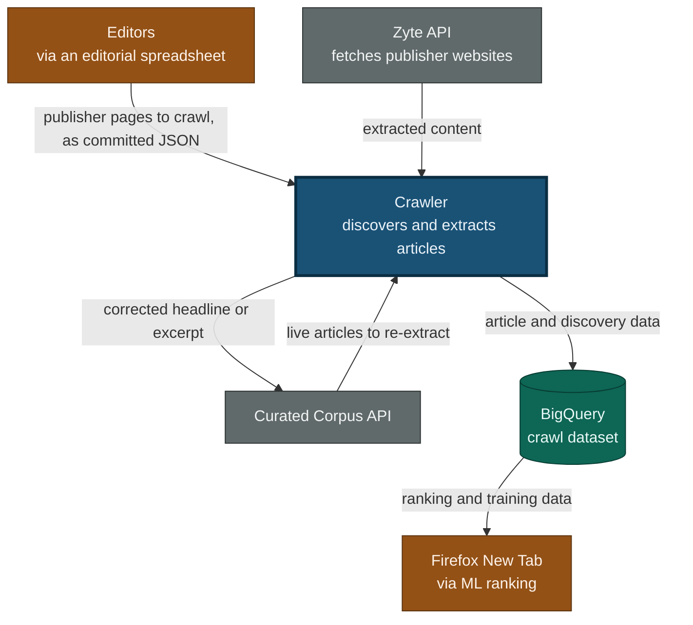
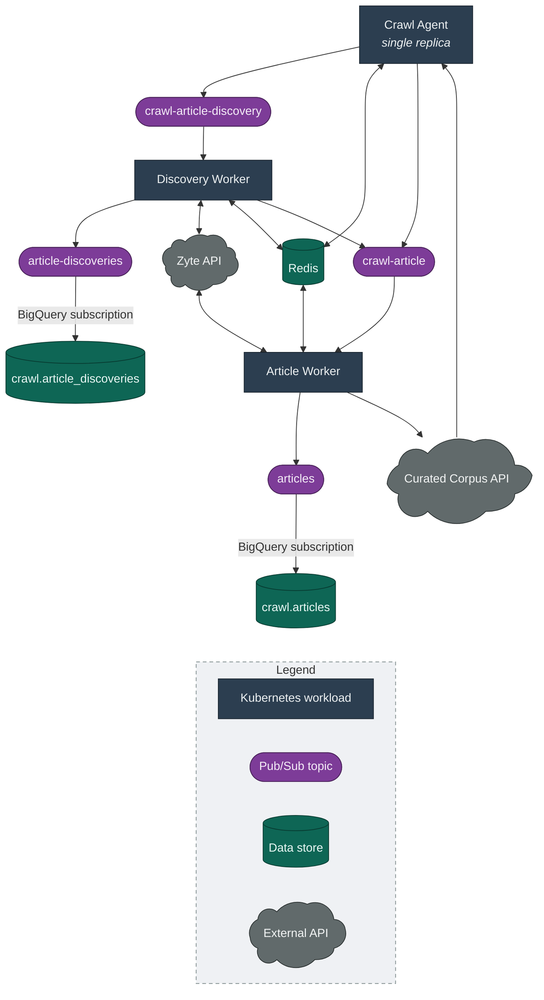
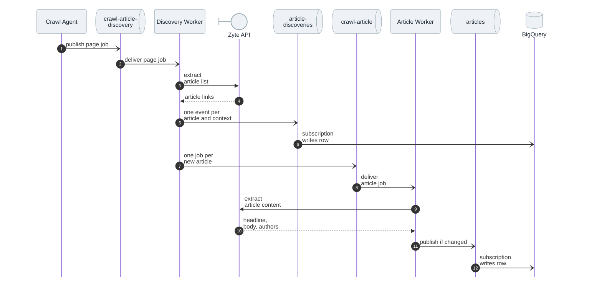
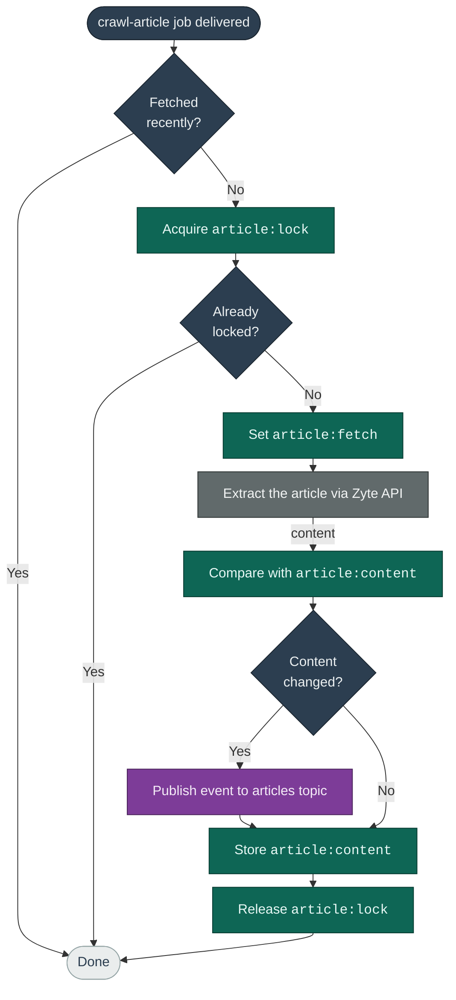

# Crawl Architecture

This document explains the crawler's main components and how content flows
from a publisher's website into BigQuery.

## What the system does

The crawler keeps Firefox New Tab supplied with fresh article content. It visits
publisher pages, discovers the articles linked from them, extracts each
article's text and metadata, and streams the results into BigQuery, where
machine learning ranks them for users.

The system is event driven. A single scheduler decides what to crawl, and a
pool of stateless workers carries out the crawling. The scheduler and workers
communicate only through Pub/Sub, never directly.

## System context

The crawler sits between Mozilla's editorial curation and the ML selection that
feeds Firefox New Tab. This view shows the external systems it exchanges data
with, and why.

Editors maintain the list of publisher pages to crawl in an [editorial spreadsheet](https://docs.google.com/spreadsheets/d/1xlZnDQjVnfhGvxuFhAvktRKaKdNIZBF1zypaOTdmnzQ/edit?gid=1566790416#gid=1566790416),
which is exported to a [committed JSON file](https://github.com/mozilla/hnt-content/blob/main/services/crawl-agent/publishers.json)
that the agent reads on startup. The crawler never visits sites itself. It
drives the Zyte API to fetch and extract those pages and the articles found on
them, and the extracted content flows back from Zyte. The crawler streams its
results into the BigQuery crawl dataset for
[ML selection](https://github.com/mozilla/content-ml-services/blob/main/jobs/metaflow/prospecting/RSSSubtopicsFlow.py#L75).
Its relationship with the [Curated Corpus API](https://github.com/Pocket/content-monorepo/tree/main/servers/curated-corpus-api)
runs both ways. It reads the current set of live articles to re-extract them,
and updates the stored headline or excerpt when the fresh text differs.

### Expected latency

Latency accumulates across that whole chain. The timeline below follows an
article from publication to the moment it is available in the New Tab feed.
The crawler owns the first two bars. ML selection and serving are downstream
systems that this design does not change.

```mermaid
%%{init: {'gantt':{'useWidth':860,'leftPadding':85,'rightPadding':200},'themeVariables':{'doneTaskBkgColor':'#aab7b8','doneTaskBorderColor':'#37474f','activeTaskBkgColor':'#aed6f1','activeTaskBorderColor':'#1a5276','taskBkgColor':'#5d6d7e','taskBorderColor':'#2c3e50'}}}%%
gantt
    title Average time from publication to availability in the New Tab feed
    dateFormat HH:mm:ss
    axisFormat %H:%M
    tickInterval 15minute
    todayMarker off

    section Crawler
    Wait for crawl :done, a1, 00:00:00, 10m
    Crawl :active, a2, after a1, 2m

    section ML selection
    Wait for sections flow :done, a3, after a2, 15m
    Sections Flow :active, a4, after a3, 22m

    section Serving
    Merino cache :done, a5, 00:49:19, 1m
    Firefox cache :done, a6, after a5, 18m

    section Total
    68 min :milestone, m1, 01:08:19, 0m
```

| Stage | Average | What sets it |
|---|---|---|
| Wait for crawl | 10 min | Half the 20-minute revisit interval every page uses |
| Crawl | 2 min | Agent tick, the two Zyte calls, and the BigQuery subscription |
| Wait for sections flow | 15 min | Half the flow's 30-minute period |
| Sections Flow | 22 min | Measured for `NEW_TAB_EN_US`; the 14-locale average is about 16 min |
| Merino cache | 1 min | Half the [2-minute serving cache](https://github.com/mozilla-services/merino-py/blob/main/merino/curated_recommendations/corpus_backends/sections_backend.py#L86) |
| Firefox cache | 18 min | Half the [30-minute client cache](https://searchfox.org/firefox-main/source/browser/extensions/newtab/lib/DiscoveryStreamFeed.sys.mjs), checked on a 5-minute tick |

<!--
Sections Flow: in moz-fx-mozsoc-ml-prod.prod_ml_stats.sections_timing, take
AVG(TIMESTAMP_DIFF(sent_time, start_time, SECOND)) grouped by locale over the
last 30 days. On 2026-08-03 that gave 21.3 min for en_US and 15.8 min across
all 14 locales. Add the ~1 min trigger-to-start queue delay, recoverable from
the epoch encoded in the Metaflow run_id.

Merino cache: WaitRandomExpiration(110s, 130s) in merino-py at
merino/curated_recommendations/corpus_backends/sections_backend.py, so ~1 min
on average. The small gap before that bar is the hop from the flow to the
corpus, through an SQS queue and the section-manager Lambda. That Lambda runs
in ~1s, but it is pinned to one concurrent invocation with one message per
batch, so a run's ~16 messages drain serially rather than in parallel and the
hop averages ~19s. It is drawn as a gap rather than a labelled bar because it
is too short to name usefully. About 1% of messages exceed a minute on it.
-->

Waiting dominates, not work. Discovering an article, extracting it, and landing
the row in BigQuery takes about two minutes. An article published just before
its page is due arrives sooner, and one that just misses every wait in the
chain takes roughly twice as long. The page crawl interval is the one latency
lever this repo owns, and it is not free: article list extraction is the bulk
of the [Zyte bill](https://app.zyte.com/o/612928/subscriptions/billing-history),
so halving the interval halves the first bar but roughly doubles that cost.

## Components

The whole system lives in one TypeScript monorepo with two entry points: the
agent and the worker. The worker deploys in two roles, so the running system
has three Kubernetes workloads. Shared packages hold their common code.

### Workloads

The **[Crawl Agent](https://github.com/mozilla/hnt-content/tree/main/services/crawl-agent)** is the scheduler, running as a single replica. Every minute
it decides which publisher pages and live articles are due for a crawl, and
publishes each job to the matching Pub/Sub queue. It reads the page list once
at startup from a committed JSON file and polls the Curated Corpus API for
live articles.

The **[Crawl Worker](https://github.com/mozilla/hnt-content/tree/main/services/crawl-worker)** processes the jobs the agent publishes, and it runs in two
roles selected by the `WORKER_ROLE` environment variable. As a
**Discovery Worker** it reads a page, finds the articles linked from it, and
enqueues each one for extraction. As an **Article Worker** it reads a single
article and extracts its content. Both roles are built from the same image and
deploy as separate, independently scalable workloads. Neither keeps local
state, since their durable state lives in Redis, so Kubernetes can add or
remove replicas at any time.

### Queues and topics

Four Pub/Sub resources link the workloads. The two **job queues**,
`crawl-article-discovery` and `crawl-article`, carry work to the two worker
roles. Each job queue also has a dead-letter topic, which catches malformed
payloads and jobs that fail before a worker records its fetch time. The two
**event topics**, `article-discoveries` and `articles`, each have a BigQuery
subscription that writes every message straight into the matching table, so
there is no separate loading step.

### Shared packages

Shared packages keep the agent and worker thin and the responsibilities clear.

| Package | Responsibility |
|---|---|
| [`crawl-common`](https://github.com/mozilla/hnt-content/tree/main/packages/crawl-common) | Domain types, message validation, Redis key names, the Corpus API client, and text helpers |
| [`zyte`](https://github.com/mozilla/hnt-content/tree/main/packages/zyte) | Client for the Zyte extraction API, including retries on transient errors |
| [`pubsub`](https://github.com/mozilla/hnt-content/tree/main/packages/pubsub) | Consumer and publisher helpers with batching and graceful drain |
| [`redis-state`](https://github.com/mozilla/hnt-content/tree/main/packages/redis-state) | Timestamps, distributed locks, and a distributed rate limiter over Redis |
| [`metrics`](https://github.com/mozilla/hnt-content/tree/main/packages/metrics) | StatsD metrics client |
| [`sentry`](https://github.com/mozilla/hnt-content/tree/main/packages/sentry) | Error reporting with per-message context |

The generic packages know nothing about the crawler. `crawl-common` layers the
crawl-specific domain on top, and the agent and worker build on them.

## How an article flows through the system

The sequence below traces one discovered article from a publisher page to a row
in BigQuery, through both workers.

The discovery worker emits one discovery event per context, meaning each
pairing of a surface (a localized New Tab feed) with a content topic the page
was crawled under, so an article discovery is recorded once per localized
topic. It keeps only links on the publisher's own domain and removes duplicates
before that fan-out, then enqueues each new article for extraction. The article
worker extracts the content and publishes an article event, and both kinds of
event reach BigQuery through their subscriptions.

Live articles take a shorter path. The agent enqueues them straight onto the
`crawl-article` queue with their corpus record attached. When the article worker
extracts one, it compares the fresh headline and excerpt against that record and
updates the Curated Corpus API when they differ, before publishing the article
event. Publishers often revise a headline as a story develops, so this keeps
what New Tab shows current.

## Deduplication and idempotency

The same article often appears on several publisher pages, and Pub/Sub delivers
each message at least once, so a URL can be enqueued more than once and two
workers can pick it up at the same time. The workers guard against this with
several Redis keys.

Three mechanisms make the workers idempotent:

1. The **freshness check** skips any URL that was crawled within its interval,
   so the crawler does not re-fetch the same content on every delivery.
2. The **lock** serializes concurrent workers on the same URL, so only one calls
   Zyte and the rest skip.
3. The **content hash** limits publishing to changed content, so unchanged
   articles do not fill BigQuery with duplicates.

The agent keeps its own pair of markers, recording when it last enqueued each
page rather than when one was last fetched. It ticks every minute over the whole
page list and skips any page whose marker is younger than its interval, so each
page goes out once per interval instead of once per tick. The discovery worker
guards its page crawls with a freshness check and a lock of its own, and skips
discovered articles it has fetched recently rather than queueing them again.

Because delivery is at least once, some duplicate rows still reach BigQuery.
Each table carries a timestamp, `extracted_at` for articles and `crawled_at`
for discoveries. Downstream queries take the latest row per URL and resolve the
duplicates at read time.

### Redis state

| Key | Written by | Purpose |
|---|---|---|
| `page:enqueued` | Crawl Agent | Last time a page was enqueued for discovery |
| `article:enqueued` | Crawl Agent | Last time a live article was enqueued |
| `page:fetch` | Discovery Worker | Last time a page crawl started |
| `page:lock` | Discovery Worker | Guard against concurrent page crawls |
| `article:fetch` | Article Worker | Last time an article extraction started |
| `article:lock` | Article Worker | Guard against concurrent extractions |
| `article:content` | Article Worker | Content hash for change detection |

Every key is scoped to a single URL. Fetch timestamps and content hashes expire
after a fixed retention window. Each lock expires shortly before the
Pub/Sub acknowledgement deadline, so a crashed worker cannot hold it forever.

## Message and event contracts

Four message shapes travel across the queues and topics. Workers validate the
two job messages on arrival and reject anything malformed. The two event shapes
are enforced by their TypeScript types rather than by a runtime check.

| Message | Direction | Required fields |
|---|---|---|
| `crawl-article-discovery` job | Agent to Discovery Worker | `url`, `interval_minutes`, `contexts` |
| `crawl-article` job | Agent or Discovery Worker to Article Worker | `url`, `source_url`, `crawl_id`, `enqueued_at` |
| `article-discoveries` event | Discovery Worker to BigQuery | `url`, `source_url`, `crawled_at`, `surface_id` |
| `articles` event | Article Worker to BigQuery | `url`, `extracted_at` |

A `crawl-article` job carries a `crawl_id`, a fresh identifier for that single
extraction attempt, and for a live article it also carries a corpus record.
Discovery events fan out to one message per article and context, so
every discovery job must name the surface and topic through a context. Events
require only a few core fields and treat every extracted field as optional,
since a given page may not supply all of them.

## Infrastructure and deployment

The Dockerfile builds a single image that contains both the agent and the
worker. Each Kubernetes workload overrides the container command and, for the
workers, sets `WORKER_ROLE` to choose its role. Deployment is GitOps: a merge to
`main` reaches the running workloads with no manual push.

| Step | What happens | Where to find it |
|---|---|---|
| Source | Agent and worker code in one monorepo | [hnt-content](https://github.com/mozilla/hnt-content) |
| Build | GitHub Actions builds one image on every merge to `main` | [deploy.yml](https://github.com/mozilla/hnt-content/blob/main/.github/workflows/deploy.yml) |
| Image | One image for every environment, kept in the **prod** project's registry | [Artifact Registry](https://console.cloud.google.com/artifacts/docker/moz-fx-hnt-prod/us/hnt-prod?project=moz-fx-hnt-prod) |
| Deploy | ArgoCD Image Updater spots the new digest and syncs the Helm chart | [Helm chart](https://github.com/mozilla/webservices-infra/tree/main/hnt/k8s/hnt), [tenant and image updater](https://github.com/mozilla/global-platform-admin/blob/main/tenants/hnt.yaml) |
| Cloud resources | Pub/Sub, Redis, BigQuery, and secrets, defined as Terraform | [webservices-infra](https://github.com/mozilla/webservices-infra/tree/main/hnt/tf) |

One image runs in three environments across two GCP projects. The agent runs as
a single replica, and the two worker roles autoscale.

| Environment | GCP project | BigQuery dataset |
|---|---|---|
| dev | moz-fx-hnt-nonprod | crawl_dev |
| stage | moz-fx-hnt-nonprod | crawl_stage |
| prod | moz-fx-hnt-prod | crawl |

Pub/Sub names carry the environment as a prefix. Each workload reads its
configuration from environment variables, and secrets come from Secret
Manager through the chart.

For local setup and development commands, see [README.md](../../README.md).
For contribution conventions, see [CONTRIBUTING.md](../../CONTRIBUTING.md).
