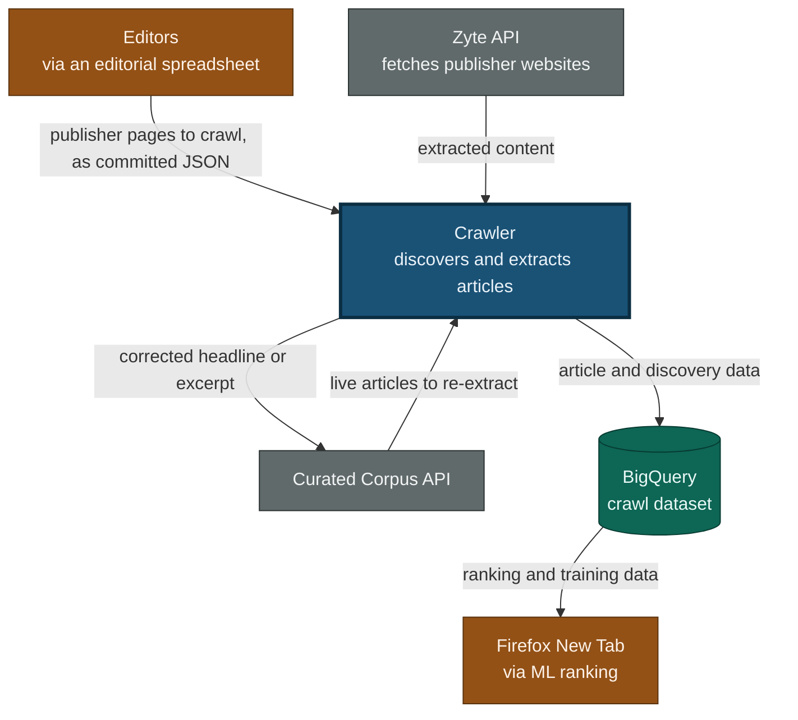
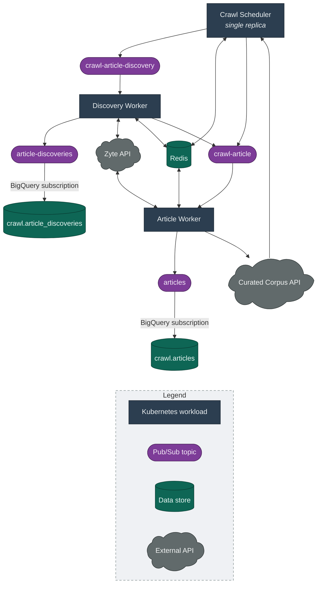
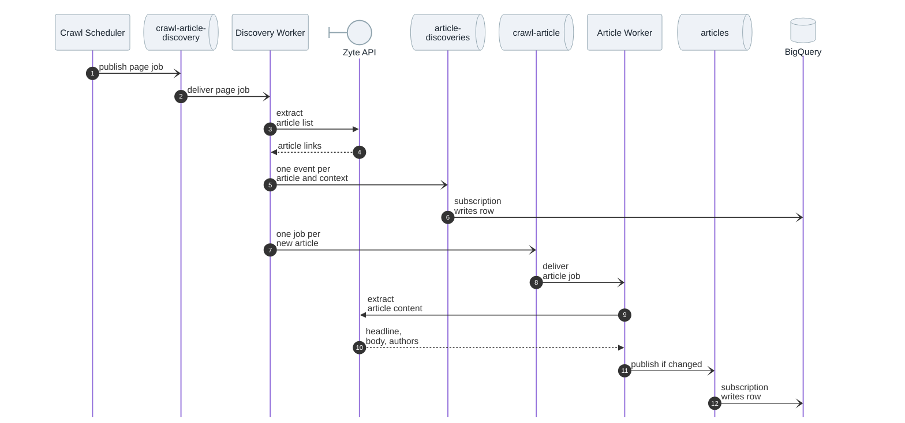
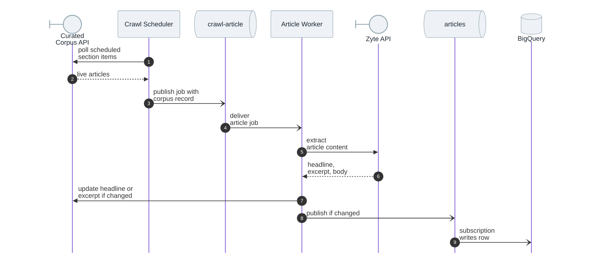

# Crawl Architecture

This document explains the crawler's main components and how content flows
from a publisher's website into BigQuery.

## What the system does

The crawler keeps Firefox New Tab supplied with fresh article content. It visits
publisher pages, discovers the articles linked from them, extracts each
article's text and metadata, and streams the results into BigQuery, where
machine learning ranks them for users. It also revisits articles already curated
for New Tab and updates their corpus items, so a stored headline or excerpt
stays accurate as a story develops.

The system is event driven. A single scheduler decides what to crawl, and a
pool of stateless workers carries out the crawling. The scheduler and workers
communicate only through Pub/Sub, never directly.

## System context

The crawler sits between Mozilla's editorial curation and the ML selection that
feeds Firefox New Tab. This view shows the external systems it exchanges data
with, and why.

Editors maintain the list of publisher pages to crawl in an [editorial spreadsheet](https://docs.google.com/spreadsheets/d/1xlZnDQjVnfhGvxuFhAvktRKaKdNIZBF1zypaOTdmnzQ/edit?gid=1566790416#gid=1566790416),
which is exported to a [committed JSON file](https://github.com/mozilla/hnt-content/blob/main/services/crawl-agent/publishers.json)
that the scheduler reads on startup. The crawler never visits sites itself. It
drives the Zyte API to fetch and extract those pages and the articles found on
them, and the extracted fields flow back, without any HTML. The crawler streams
its results into the BigQuery crawl dataset for
[ML selection](https://github.com/mozilla/content-ml-services/blob/main/jobs/metaflow/prospecting/RSSSubtopicsFlow.py#L75).
Its relationship with the [Curated Corpus API](https://github.com/Pocket/content-monorepo/tree/main/servers/curated-corpus-api)
runs both ways. It reads the current set of live articles to re-extract them,
and updates the stored headline or excerpt when the fresh text differs.

### Expected latency

Latency accumulates across that whole chain. The timeline below follows an
article from publication to the moment it is available in the New Tab feed.
The crawler owns the first two bars. ML selection and serving are downstream
systems that this design does not change.

```mermaid
%%{init: {'gantt':{'useWidth':860,'leftPadding':85,'rightPadding':200},'themeVariables':{'doneTaskBkgColor':'#aab7b8','doneTaskBorderColor':'#37474f','activeTaskBkgColor':'#aed6f1','activeTaskBorderColor':'#1a5276','taskBkgColor':'#5d6d7e','taskBorderColor':'#2c3e50'}}}%%
gantt
    title Average time from publication to availability in the New Tab feed
    dateFormat HH:mm:ss
    axisFormat %H:%M
    tickInterval 15minute
    todayMarker off

    section Crawler
    Wait for crawl :done, a1, 00:00:00, 10m
    Crawl :active, a2, after a1, 2m

    section ML selection
    Wait for sections flow :done, a3, after a2, 15m
    Sections Flow :active, a4, after a3, 22m

    section Serving
    Merino cache :done, a5, 00:49:19, 1m
    Firefox cache :done, a6, after a5, 18m

    section Total
    68 min :milestone, m1, 01:08:19, 0m
```

| Stage | Average | What sets it |
|---|---|---|
| Wait for crawl | 10 min | Half the 20-minute revisit interval every page uses |
| Crawl | 2 min | Scheduler tick, the two Zyte calls, and the BigQuery subscription |
| Wait for sections flow | 15 min | Half the flow's 30-minute period |
| Sections Flow | 22 min | Measured for `NEW_TAB_EN_US`; the 14-locale average is about 16 min |
| Merino cache | 1 min | Half the [2-minute serving cache](https://github.com/mozilla-services/merino-py/blob/main/merino/curated_recommendations/corpus_backends/sections_backend.py#L86) |
| Firefox cache | 18 min | Half the [30-minute client cache](https://searchfox.org/firefox-main/source/browser/extensions/newtab/lib/DiscoveryStreamFeed.sys.mjs), checked on a 5-minute tick |

<!--
Sections Flow: in moz-fx-mozsoc-ml-prod.prod_ml_stats.sections_timing, take
AVG(TIMESTAMP_DIFF(sent_time, start_time, SECOND)) grouped by locale over the
last 30 days. On 2026-08-03 that gave 21.3 min for en_US and 15.8 min across
all 14 locales. Add the ~1 min trigger-to-start queue delay, recoverable from
the epoch encoded in the Metaflow run_id.

Merino cache: WaitRandomExpiration(110s, 130s) in merino-py at
merino/curated_recommendations/corpus_backends/sections_backend.py, so ~1 min
on average. The small gap before that bar is the hop from the flow to the
corpus, through an SQS queue and the section-manager Lambda. That Lambda runs
in ~1s, but it is pinned to one concurrent invocation with one message per
batch, so a run's ~16 messages drain serially rather than in parallel and the
hop averages ~19s. It is drawn as a gap rather than a labelled bar because it
is too short to name usefully. About 1% of messages exceed a minute on it.
-->

Waiting dominates, not work. Discovering an article, extracting it, and landing
the row in BigQuery takes about two minutes. An article published just before
its page is due arrives sooner, and one that just misses every wait in the
chain takes roughly twice as long. The page crawl interval is the one latency
lever this repo owns, and it is not free: article list extraction is the bulk of
the crawler's [Zyte usage](https://app.zyte.com/o/612928/stats/usage), so halving
the interval halves the first bar and roughly doubles that usage.

Why each interval sits where it does, weighed against the load it drives, is not
yet documented; [HNT-2937](https://mozilla-hub.atlassian.net/browse/HNT-2937)
tracks writing it down.

### Load

Crawling puts load on two systems outside this repo: Zyte and the Curated
Corpus API. Every 20 minutes the crawler asks Zyte for each publisher page on
the editorial team's list, and for any article it finds there that it has not
extracted in the last 30 days. To keep titles accurate, it re-extracts articles
in newsy sections every 15 minutes, reading and writing to the Corpus API. Both
kinds of job are staggered across their interval to avoid load spikes.

The current page list and interval come to roughly 10,000 page crawls an hour.
A page turns up around 25 new articles a day on average; across the whole list
that is a few thousand newly discovered articles an hour. The
[Zyte stats dashboard](https://app.zyte.com/o/612928/stats/usage) shows current
cost and volume, and can separate page crawls from article extractions. The
Corpus API sees only a few dozen reads an hour and about a thousand writes a
day. Those are production figures: stage crawls a small sample of the page list,
and dev does not crawl at all.

Our Zyte account allows 10,000 requests per minute, and Zyte can raise that if
we ask. Everything using our Zyte account draws on a single quota, so any ad hoc
job competes with production traffic for the same capacity. We don't have great
visibility into our remaining capacity per minute, because Zyte's dashboard
aggregates by hour. The busiest hour in the last 90 days had 130k requests
across the account, 6x its 90-day average.

Launching a new market temporarily lifts the Zyte request rate sharply: a batch
of pages joins the list at once and most of their articles are new to the
crawler, so article extraction climbs and stays high until that set is warm. In
practice this hasn't been an issue. We may for a brief period hit the Zyte rate
limit, but the articles it could not get are picked up on a later crawl, rather
than dropped altogether.

## Components

The whole system lives in one TypeScript monorepo with two entry points: the
scheduler and the worker. The worker deploys in two roles, so the running system
has three Kubernetes workloads. Shared packages hold their common code.

### Workloads

The **[Crawl Scheduler](https://github.com/mozilla/hnt-content/tree/main/services/crawl-agent)** runs as a single replica and owns the crawl timing. It
fetches nothing itself. Every minute it works out which publisher pages and live
articles are due, and publishes a job for each to the matching Pub/Sub queue. It
reads the page list once at startup from a committed JSON file and polls the
Curated Corpus API for live articles.

The **[Crawl Worker](https://github.com/mozilla/hnt-content/tree/main/services/crawl-worker)** processes the jobs the scheduler queues, and it runs in two
roles selected by the `WORKER_ROLE` environment variable. As a
**Discovery Worker** it reads a page, finds the articles linked from it, and
enqueues each one for extraction. As an **Article Worker** it reads a single
article enqueued by the scheduler or by a discovery worker, and extracts its
content. Both roles are built from the same image and deploy as separate,
independently scalable workloads. Neither keeps local state, since their durable
state lives in Redis, so Kubernetes can add or remove replicas at any time.

### Queues and topics

Four Pub/Sub resources link the workloads. The two **job queues**,
`crawl-article-discovery` and `crawl-article`, carry work to the two worker
roles. Each job queue also has a dead-letter topic, which catches malformed
payloads and jobs that fail before a worker records its fetch time. The two
**event topics**, `article-discoveries` and `articles`, each have a BigQuery
subscription that writes every message straight into the matching table, so
there is no separate loading step.

### Shared packages

Shared packages keep the scheduler and worker thin and the responsibilities
clear.

| Package | Responsibility |
|---|---|
| [`crawl-common`](https://github.com/mozilla/hnt-content/tree/main/packages/crawl-common) | Domain types, message validation, Redis key names, the Corpus API client, and text helpers |
| [`zyte`](https://github.com/mozilla/hnt-content/tree/main/packages/zyte) | Client for the Zyte extraction API, including retries on transient errors |
| [`pubsub`](https://github.com/mozilla/hnt-content/tree/main/packages/pubsub) | Consumer and publisher helpers with batching and graceful drain |
| [`redis-state`](https://github.com/mozilla/hnt-content/tree/main/packages/redis-state) | Timestamps, distributed locks, and a distributed rate limiter over Redis |
| [`metrics`](https://github.com/mozilla/hnt-content/tree/main/packages/metrics) | OpenTelemetry metrics client |
| [`sentry`](https://github.com/mozilla/hnt-content/tree/main/packages/sentry) | Error reporting with per-message context |

The generic packages know nothing about the crawler. `crawl-common` layers the
crawl-specific domain on top, and the scheduler and worker build on them.

## How an article flows through the system

### Discovered articles

The sequence below traces one discovered article from a publisher page to a row
in BigQuery, through both workers.

Each page job is a [`CrawlArticleDiscoveryMessage`](https://github.com/mozilla/hnt-content/blob/main/packages/crawl-common/src/types/messages.ts)
carrying the page URL, its crawl interval, and its contexts. A context is one
pairing of a surface (a localized New Tab feed) with a content topic the page
was crawled under, such as `NEW_TAB_DE_DE` and `sports`. The discovery worker
emits one [`ArticleDiscoveryEvent`](https://github.com/mozilla/hnt-content/blob/main/packages/crawl-common/src/types/events.ts)
per article per context, so a discovery is recorded once for each localized
topic the page serves. The worker keeps only links on the publisher's own domain
and removes duplicates before that fan-out, then enqueues each new article as a
[`CrawlArticleMessage`](https://github.com/mozilla/hnt-content/blob/main/packages/crawl-common/src/types/messages.ts).
The article worker extracts the content and publishes an
[`ArticleEvent`](https://github.com/mozilla/hnt-content/blob/main/packages/crawl-common/src/types/events.ts),
and both kinds of event reach BigQuery through their subscriptions. Redis keeps
both workers from re-fetching anything crawled recently; see
[DEDUPLICATION.md](DEDUPLICATION.md).

### Live articles

Articles already curated for New Tab take a shorter path, because the scheduler
enqueues them itself and no discovery step runs. Publishers often revise a
headline as a story develops, so we revisit them to keep New Tab current.

Only the discovery hop is skipped, not the safeguards. The article worker
applies the same freshness check and lock as it does for a discovered article,
but against the shorter refresh window the scheduler sets on the job instead of
the worker's longer default. When the worker extracts a live article, it
compares the fresh headline and excerpt against the attached corpus record and
updates the Curated Corpus API when they differ, before publishing the article
event. For the refresh windows and the Redis keys behind those checks, see
[DEDUPLICATION.md](DEDUPLICATION.md).

## Infrastructure and deployment

The Dockerfile builds a single image that contains both the scheduler and the
worker. Each Kubernetes workload overrides the container command and, for the
workers, sets `WORKER_ROLE` to choose its role. Deployment is GitOps: a merge to
`main` reaches the running workloads with no manual push.

| Step | What happens | Where to find it |
|---|---|---|
| Source | Scheduler and worker code in one monorepo | [hnt-content](https://github.com/mozilla/hnt-content) |
| Build | GitHub Actions builds one image on every merge to `main` | [deploy.yml](https://github.com/mozilla/hnt-content/blob/main/.github/workflows/deploy.yml) |
| Image | One image for every environment, kept in the **prod** project's registry | [Artifact Registry](https://console.cloud.google.com/artifacts/docker/moz-fx-hnt-prod/us/hnt-prod?project=moz-fx-hnt-prod) |
| Deploy | ArgoCD Image Updater spots the new digest and syncs the Helm chart | [Helm chart](https://github.com/mozilla/webservices-infra/tree/main/hnt/k8s/hnt), [tenant and image updater](https://github.com/mozilla/global-platform-admin/blob/main/tenants/hnt.yaml) |
| Cloud resources | Pub/Sub, Redis, BigQuery, and secrets, defined as Terraform | [webservices-infra](https://github.com/mozilla/webservices-infra/tree/main/hnt/tf) |

One image runs in three environments across two GCP projects. The scheduler runs
as a single replica, and the two worker roles autoscale.

| Environment | GCP project | BigQuery dataset |
|---|---|---|
| dev | moz-fx-hnt-nonprod | crawl_dev |
| stage | moz-fx-hnt-nonprod | crawl_stage |
| prod | moz-fx-hnt-prod | crawl |

Pub/Sub names carry the environment as a prefix. Each workload reads its
configuration from environment variables, and secrets come from Secret
Manager through the chart.
