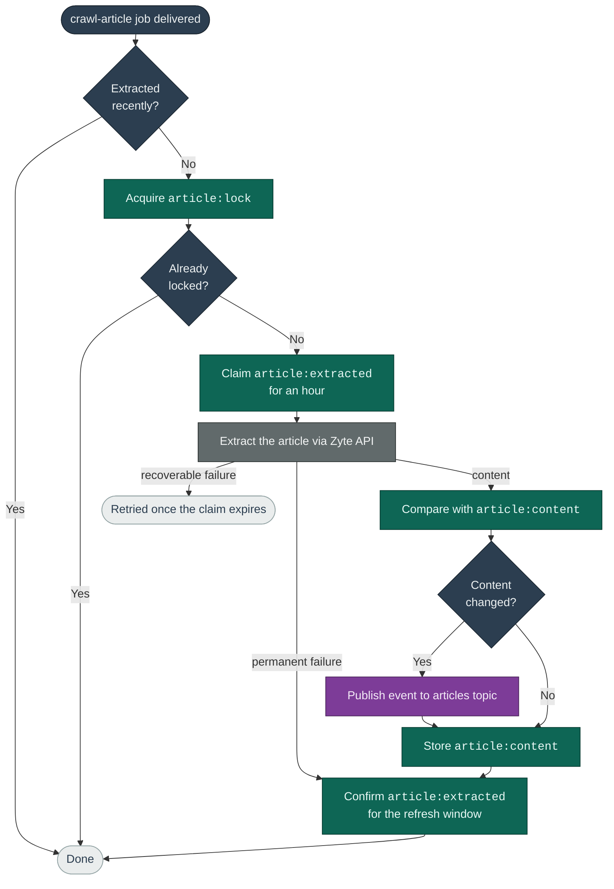

# Deduplication

This document explains how the crawl workers avoid redundant work and stay safe
under duplicate delivery. For the components and data flow, see
[ARCHITECTURE.md](ARCHITECTURE.md). The design philosophy is to balance
simplicity, cost-efficiency, and resilience to failures.

## The problem this solves

The same URL can reach the crawler many times. Most often it is because a page
still lists an article we already extracted, or because several pages carry it.
We do not want to pay Zyte to re-extract articles needlessly, yet in other
scenarios we _do_ want to extract the same URL again. The most common scenarios
are listed below.

| Why the same article URL comes back | Fetch it again? |
|---|---|
| A page is crawled again and still links the article | ❌ No, we extracted it recently |
| Several publisher pages link the same article | ❌ No, one extraction serves them all |
| The article returns a 404 or other non-recoverable error | ❌ No, there is nothing left to fetch |
| At-least-once delivery duplicates a job | ❌ No, another worker has it or already did it |
| An article is live on New Tab | ✅ Yes, every 15 minutes so headlines remain accurate |
| Extraction fails with a [520](https://docs.zyte.com/zyte-api/usage/errors.html#ban-responses) or other recoverable error | ✅ Yes, Zyte recommends retrying, and doesn't charge for them |
| Zyte experiences an outage | ✅ Yes, because the crawler should recover on its own |
| Our record of the extraction expired | ✅ Yes, we balance the cost of re-extracting old featured articles against the cost of storing more records in Redis |

## Guarding an article extraction

Three mechanisms make the workers idempotent, so handling the same job twice
costs no more than handling it once:

1. The **freshness check** skips any URL extracted within its refresh window,
   so the crawler does not re-fetch the same content on every delivery.
2. The **lock** serializes concurrent workers on the same URL, so only one calls
   Zyte and the rest skip.
3. The **content hash**, taken over every content column of `crawl.articles`,
   limits publishing to changed content, so unchanged articles do not fill
   BigQuery with duplicates.

The `article:extracted` marker is written twice. The worker claims the URL for
an hour before the Zyte call, then rewrites it for the full refresh window once
the work is done, meaning a successful extraction or a permanent failure. The
claim stops one failure from multiplying: Pub/Sub would otherwise redeliver the
message up to five times, and the same URL is often linked from several pages. A
recoverable failure leaves only the claim, so the URL is tried again on the
first page crawl after the hour is up.

## Refresh windows

| Variable | What it sets | Default | Shorter | Longer |
|---|---|---|---|---|
| `pageRefreshMinutes` | How often a page is crawled again | 20 min | Faster discovery | Main lever to lower Zyte cost |
| `discoveredArticleRefreshDays` | How long an extracted article is left alone | 30 days | Less Redis memory usage | Slightly reduced Zyte cost |
| `liveArticleRefreshMinutes` | How often a curated article is re-extracted | 15 min | Fresher headlines | Fewer Zyte calls |
| `articleAttemptTtlMinutes` | How long a failed attempt blocks the next one | 60 min | Faster recovery from a block | Fewer requests on URLs that keep failing |

A live article carries its window on the message, so it dedups on the
scheduler's cadence rather than the worker's longer default.

## The scheduler and the discovery worker

The scheduler keeps its own pair of markers, recording when it last enqueued
each page or live article rather than when one was last fetched. It ticks every
minute over the whole list and skips anything whose marker is younger than its
interval, so each item goes out once per interval instead of once per tick.
Because the scheduler is a single replica, a plain check-then-set is enough
here, so no lock is needed.

The discovery worker guards its page crawls with a freshness check and a lock of
its own, and checks each discovered article against `article:extracted` so it
does not queue a URL that was extracted recently.

## Redis state

| Key | Written by | Purpose |
|---|---|---|
| `page:enqueued` | Crawl Scheduler | Last time a page was enqueued for discovery |
| `article:enqueued` | Crawl Scheduler | Last time a live article was enqueued |
| `page:fetch` | Discovery Worker | Last time a page crawl started |
| `page:lock` | Discovery Worker | Guard against concurrent page crawls |
| `article:extracted` | Article Worker | Last time an article extraction finished |
| `article:lock` | Article Worker | Guard against concurrent extractions |
| `article:content` | Article Worker | Content hash for change detection |

Markers and content hashes are retained for the longest refresh window, 30 days,
so the key space stays bounded by how many distinct URLs the crawler has seen
recently rather than growing forever. Lengthening a window means lengthening
retention with it.

## Duplicates that still reach BigQuery

Both tables hold more than one row per URL by design. `article_discoveries`
gets a row each time a crawl finds the article, and `articles` gets one each
time the extracted content changes. Those rows are history, not duplicates: the
`crawled_at` and `extracted_at` timestamps distinguish them.

Pub/Sub loads BigQuery with at-least-once delivery, so real duplicates arrive
too: the same event written more than once. Downstream queries remove them with
a [QUALIFY](https://docs.cloud.google.com/bigquery/docs/reference/standard-sql/query-syntax#qualify_clause) clause.
