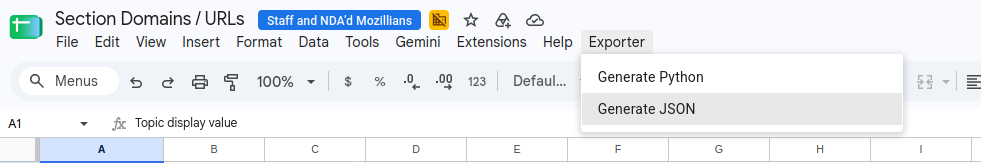
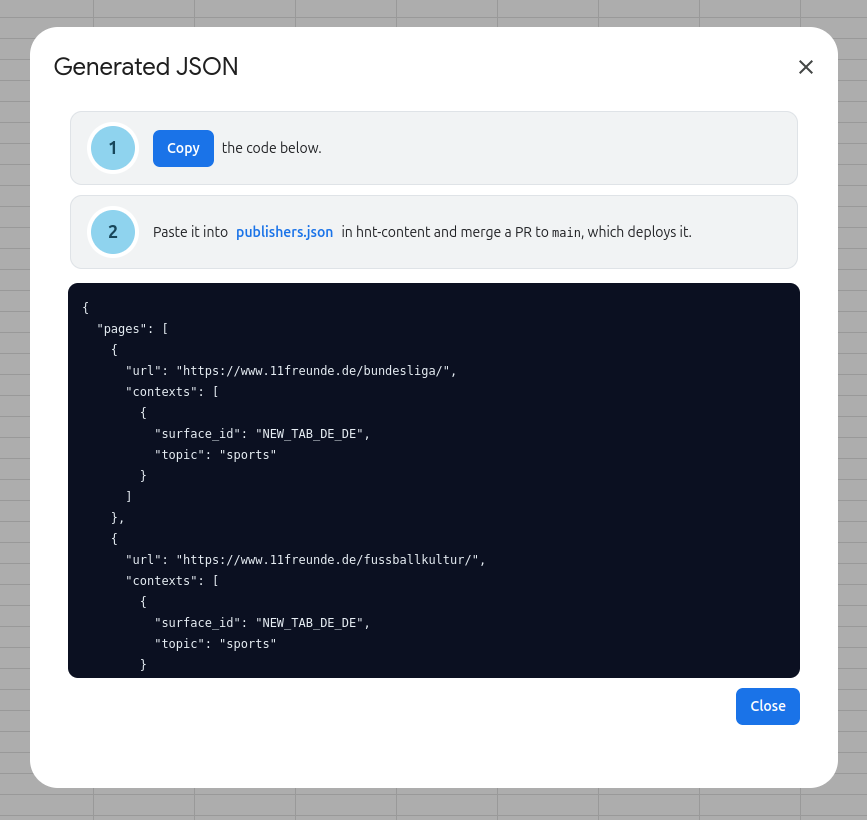

# Publisher pages

The crawler discovers stories from a fixed list of publisher section pages, such as a newspaper's technology or sports page. Editors maintain that list in the [section URL spreadsheet](https://docs.google.com/spreadsheets/d/1xlZnDQjVnfhGvxuFhAvktRKaKdNIZBF1zypaOTdmnzQ/edit?gid=1566790416), one sheet per locale, and mark a row **Approved** when it is ready to crawl. Its export is committed here as [`publishers.json`](../../services/crawl-scheduler/src/data/publishers.json), which the scheduler reads on every tick. For where it fits in the wider system, see [ARCHITECTURE.md](ARCHITECTURE.md).

## Updating the list

Choose **Exporter > Generate JSON** in the spreadsheet, then follow the two steps in the dialog.

The menu is built by a script that runs when the spreadsheet opens, so give it a moment to appear. Generating takes a few seconds more, since it reads every locale sheet.

**Generate Python** beside it writes `pages.py` for the older crawler, and stays until that pipeline is switched off.

## What the export writes

Each approved row becomes one context under its page URL, so a page approved for several locales or topics is a single entry with several contexts.

A Section URL cell holding only a host and path, such as `grist.org`, is read as https. Sheets renders one as a link and data validation does not reject it, so the row would otherwise be approved and never crawled.

The topic is a New Tab section id, taken from the **Section id** column of the "Topics" sheet, so the crawler records `tech` rather than the display value "Technology". A topic with no section id fails the export with an error naming it.

A sheet named `DRAFT FR` is not found, so a locale starts being crawled when editors drop the prefix. The dialog names any sheet it could not find.

Nothing checks the file at runtime. [`publishers.spec.ts`](../../services/crawl-scheduler/src/publishers.spec.ts) checks the committed copy in CI instead, because the file that is committed is the file that deploys.

## The script

[`sheets-app-script.js`](sheets-app-script.js) is the whole Apps Script project bound to the spreadsheet, and this repository is its source of truth. It holds both exports, and the Python half is deleted along with the crawler that needs it.

Edit it here and paste it over the spreadsheet's `Code.gs`, never the other way around. Save, reload the spreadsheet, and run both exports to check them. The menu is rebuilt only when the spreadsheet opens, so saving alone will not change it.

The tabs it reads are listed in `sources`, each pairing a sheet name with the surface it feeds. A renamed tab is reported as missing in the dialog, along with the tabs the spreadsheet does have, so correct `sources` here and paste again.
